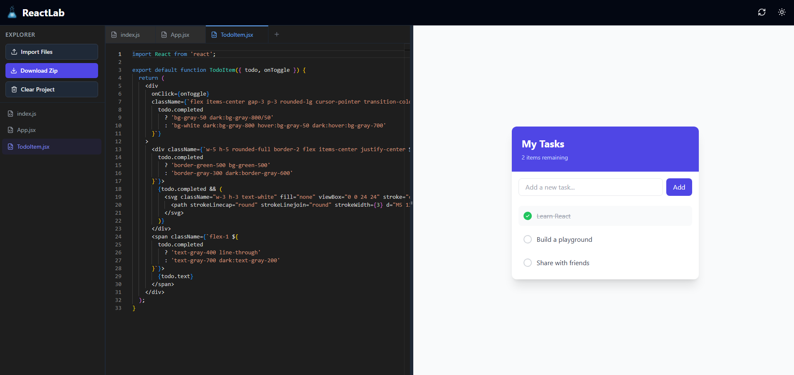

# ReactLab ⚛️

A modern, fast, and visually appealing React Playground / Component Sandbox. Write React code in real-time and see live previews instantly.



## Features

- 🚀 **Live Preview**: Instant feedback as you type.
- 📝 **Monaco Editor**: VS Code-like editing experience with syntax highlighting and IntelliSense.
- 🎨 **Modern UI**: Clean, split-pane layout with dark/light mode support.
- 🛠 **Templates**: Start quickly with pre-built templates (Counter, Card, Todo List).
- 📦 **Babel Standalone**: In-browser JSX compilation.
- 💅 **Tailwind CSS**: Built-in support for utility-first styling.

## Tech Stack

- **Framework**: React 18 + Vite
- **Editor**: @monaco-editor/react
- **Styling**: Tailwind CSS
- **Compiler**: @babel/standalone
- **Icons**: Lucide React
- **Layout**: react-resizable-panels

## Getting Started

1. **Clone the repository**
   ```bash
   git clone https://github.com/Bralekfn/react-lab.git
   cd react-lab
   ```

2. **Install dependencies**
   ```bash
   npm install
   ```

3. **Start the development server**
   ```bash
   npm run dev
   ```

4. **Open in browser**
   Navigate to `http://localhost:5173`

## Usage

- **Write Code**: Edit the `App` component in the left pane.
- **Toggle Theme**: Switch between light and dark modes.
- **Reset/Share**: Reset code to the template default or copy code to clipboard.

## License

MIT License

Copyright (c) 2026 Bralekfn